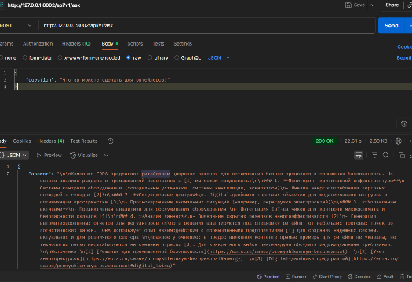

# EORA QA API Service

## Быстрый старт

### 1. Клонируйте репозиторий
```bash
git clone https://github.com/Wiltort/EORA.git
cd EORA
```
### 2. Создайте и настройте .env
Создайте файл .env в корне проекта и добавьте ваш OpenAI API ключ:
```
API_KEY=your_openai_api_key
```
### 3. Запустите сервис через Docker Compose
```bash
docker-compose up --build
```
Сервис будет доступен на порту 8002.

### 4. Swagger-документация
Откройте http://localhost:8002/docs для просмотра и тестирования API.

## Пример запроса
- POST /api/v1/ask
Тело запроса:

```json
{
  "question": "Что вы можете сделать для ритейлеров?",
  "history": []
}
```
В историю можно передавать предыдущие пары вопрос-ответ (схема в документации)
- Ответ:
```
{
    "answer": "\n\nКомпания EORA предлагает ритейлерам цифровые решения для оптимизации бизнес-процессов и повышения безопасности. На основе анализа раздела о промышленной безопасности [1] мы можем предложить:\n\n### 1. **Мониторинг критической инфраструктуры**\n- Системы контроля оборудования (холодильные установки, системы вентиляции, эскалаторы)\n- Анализ энергопотребления торговых площадей и складов [2]\n\n### 2. **Ситуационные центры**\n- Digital-двойники торговых объектов для моделирования нагрузок и оптимизации пространства [3]\n- Прогнозирование аномальных ситуаций (например, перегрузка электросетей)\n\n### 3. **Управление активами**\n- Предиктивная аналитика для обслуживания оборудования \n- Интеграция IoT-датчиков для контроля микроклимата и безопасности складов [1]\n\n### 4. **Анализ данных**\n- Выявление скрытых резервов энергоэффективности [2]\n- Генерация автоматизированных отчетов для регуляторов \n\nЭти решения адаптируются под специфику ритейла: от небольших торговых точек до логистических хабов. EORA использует опыт взаимодействия с промышленными предприятиями [1] для создания надежных систем, актуальных и для розничного сектора.\n\nВажное уточнение: в предоставленном контенте прямые примеры для ритейла не указаны, но технологии легко масштабируются на смежные отрасли [3]. Для конкретного кейса рекомендуем обсудить индивидуальные требования.\n\nИсточники:\n[1] [Решения для промышленной безопасности](https://eora.ru/cases/promyshlennaya-bezopasnost)  \n[2] [Учет энергоресурсов](https://eora.ru/cases/promyshlennaya-bezopasnost#energy)  \n[3] [Digital-двойники предприятий](https://eora.ru/cases/promyshlennaya-bezopasnost#digital_twins)"
}
```


### Итог:
- Пробовал делать поточную передачу, в принципе данные приходили, но решил пока оставить так. Ответы в потоке приходят неоптимизированные и качество их хуже. Пока не понял как исправить. В тексте мало ссылок.
- Попробовал использовать историю сообщений для контекста, норм
- В дальнейшем какой нибудь фронт можно приделать чтобы удобнее было.